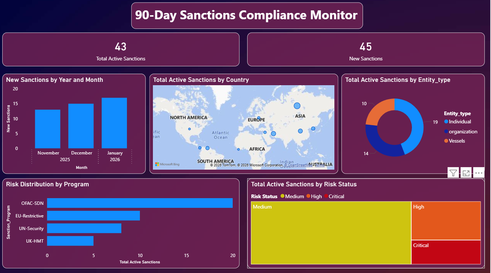

90-Day Sanctions Compliance Monitor
Project Overview
This Power BI dashboard was designed to monitor and analyze global sanctions data over a rolling 90-day window (Nov 2025 – Jan 2026). It assists compliance teams in tracking high-risk entities, understanding geographic hotspots, and monitoring weekly sanction trends.

Key Features
Risk Analysis: Categorizes entities into Critical, High, and Medium risk levels using custom DAX logic.

Geospatial Tracking: Interactive map visualizing active sanctions across global regions.

Entity Breakdown: Donut chart analysis distinguishing between Individuals, Organizations, and Vessels.

Trend Monitoring: Monthly bar charts to track the influx of new sanctions.

Tools Used
Power BI: Data modeling, DAX calculations, and interactive visualization.

Power Query: Data cleaning and merging multiple CSV sources.

Key DAX Measures
Risk Status Logic: Risk Status = IF(ISBLANK('Master_Sanctions'[Risk_Level]), "Medium", 'Master_Sanctions'[Risk_Level])

Total Active Sanctions: Total Active Sanctions = CALCULATE(COUNTROWS('Master_Sanctions'), 'Master_Sanctions'[Status] = "Active")
